# Daily Digest — Execution Flow

Full execution path for the `/daily-digest` skill: preflight, discovery
branching, URL verification, compose & score, Apple Notes output, and
state writes.

**Color key:**
- Gold border — decision / branch point
- Green border — external API call
- Gray border — fallback / degraded path
- Blue border — phase cache read/write
- Purple border — output / state write
- Red border — error / non-blocking failure

See also: [daily-digest-flow.html](daily-digest-flow.html) for an
interactive version with clickable nodes and scenario simulation.

---

```mermaid
flowchart TD
    START(["▶  /daily-digest"])

    subgraph P0["Phase 0 — Preflight"]
        RC["Read config<br/>candidate.md · search.md"]
        RS["Read state<br/>seen-postings · preferences"]
        CS["Compute search_since<br/>from last_run_date"]
        TSC{"theirstack-config.md<br/>exists?"}
        BC{"month_total + daily_budget<br/>≥ 200 credits?"}
        TSON["use_theirstack = true"]
        TSOFF["use_theirstack = false"]
        NOC["(Optional) Read<br/>notes-config.md"]

        RC --> RS --> CS --> TSC
        TSC -->|No config| TSOFF
        TSC -->|Config found| BC
        BC -->|Budget OK| TSON
        BC -->|Budget exhausted| TSOFF
        TSON --> NOC
        TSOFF --> NOC
    end

    subgraph CC["Phase Cache Check"]
        CP2{"phase2 cached?<br/>(2 h TTL)"}
        RP3{"Prompt: resume<br/>from Phase 3?"}
        CP1{"phase1 cached?<br/>(2 h TTL)"}
        RP2{"Prompt: resume<br/>from Phase 2?"}

        CP2 -->|Hit| RP3
        CP2 -->|Miss| CP1
        RP3 -->|"Fresh — restart"| CP1
        CP1 -->|Hit| RP2
    end

    subgraph P1["Phase 1 — Discovery"]
        TSQ{"use_theirstack?"}
        TSAPI["TheirStack API<br/>POST · title regex · posted_at_gte · limit 10"]
        TSOK{"200 OK &amp;<br/>non-empty results?"}
        TSERR["Log error · use_theirstack = false"]
        WSFALL["WebSearch fallback<br/>6 parallel queries<br/>Greenhouse · Lever · Ashby · edtech · climate · mission"]
        DOW{"Monday or Thursday?"}
        NICHE["Niche board WebSearch<br/>3 parallel queries<br/>Tech Jobs for Good · Purpose Jobs · Built In"]
        SKIPN["Skip niche search"]
        MERGE1["Merge all discovery results"]
        CP1W[("Cache Phase 1<br/>bun cache.js write phase1")]

        TSQ -->|Yes| TSAPI
        TSQ -->|No| WSFALL
        TSAPI --> TSOK
        TSOK -->|No| TSERR --> WSFALL
        TSOK -->|Yes| DOW
        WSFALL --> DOW
        DOW -->|Yes| NICHE --> MERGE1
        DOW -->|No| SKIPN --> MERGE1
        MERGE1 --> CP1W
    end

    subgraph P2["Phase 2 — URL Verification"]
        QURL["Filter aggregator URLs<br/>Resolve to direct ATS links"]
        ROUTE{"Route by<br/>URL domain"}
        GHAPI["Greenhouse API<br/>boards-api.greenhouse.io"]
        LVAPI["Lever API<br/>api.lever.co"]
        ABAPI["Ashby API<br/>jobs.ashbyhq.com"]
        WFFB["WebFetch fallback<br/>HTML parse"]
        VMERGE["Merge: open · closed · unknown"]
        CP2W[("Cache Phase 2<br/>bun cache.js write phase2")]

        QURL --> ROUTE
        ROUTE -->|"greenhouse.io"| GHAPI
        ROUTE -->|"lever.co"| LVAPI
        ROUTE -->|"ashbyhq.com"| ABAPI
        ROUTE -->|other| WFFB
        GHAPI & LVAPI & ABAPI & WFFB --> VMERGE --> CP2W
    end

    subgraph P3["Phase 3 — Compose & Score"]
        DEDUP["Dedup against seen-postings<br/>filter already-seen URLs"]
        SCORE["Score roles<br/>star ratings · comp eval · mission fit"]
        HTMLW[["Write output/digest-{date}.html"]]
        TSFTR{"TheirStack OFF due<br/>to error or budget?"}
        FOOTER["Append footer note<br/>TheirStack unavailable · reason"]

        DEDUP --> SCORE --> HTMLW --> TSFTR
        TSFTR -->|Yes| FOOTER
    end

    READY(["Digest ready"])

    subgraph P4["Phase 4 — Apple Notes (optional)"]
        P4NC{"notes-config.md<br/>exists?"}
        P4SKIP["Skip — output HTML only"]
        P4WRITE["Create Apple Notes entry<br/>osascript"]
        P4ERR{"Write error?"}
        P4ERRLOG["Log error · surface to user<br/>HTML is fallback · never silent"]

        P4NC -->|No| P4SKIP
        P4NC -->|Yes| P4WRITE
        P4WRITE --> P4ERR
        P4ERR -->|"Yes (non-blocking)"| P4ERRLOG
    end

    subgraph P5["Phase 5 — State Writes"]
        P5START["Write state files"]
        SPAP[["Append seen-postings<br/>all roles: open + closed"]]
        PRAP[["Append preferences<br/>source counts · TheirStack credits"]]
        P5NC{"Apple Notes<br/>configured?"}
        P5NOTES["Update Apple Notes<br/>Seen Postings · Preferences"]
        DONE(["✓  Done"])

        P5START --> SPAP & PRAP
        SPAP & PRAP --> P5NC
        P5NC -->|Yes| P5NOTES --> DONE
        P5NC -->|No| DONE
    end

    %% Inter-phase connections
    START --> RC
    NOC --> CP2
    RP3 -->|"Yes — resume"| DEDUP
    RP2 -->|"Yes — resume"| QURL
    RP2 -->|"Fresh — restart"| TSQ
    CP1 -->|Miss| TSQ
    CP1W --> QURL
    CP2W --> DEDUP
    TSFTR -->|No| READY
    FOOTER --> READY
    READY --> P4NC
    P4ERR -->|No| P5START
    P4ERRLOG --> P5START
    P4SKIP --> P5START

    %% Color coding
    classDef startEnd fill:#1c2333,stroke:#58a6ff,color:#f0f6fc
    classDef step fill:#161b22,stroke:#30363d,color:#c9d1d9
    classDef decision fill:#3d2e00,stroke:#d29922,color:#e3b341
    classDef apiNode fill:#0d3320,stroke:#3fb950,color:#3fb950
    classDef fallback fill:#1c2023,stroke:#8b949e,color:#8b949e
    classDef cacheNode fill:#0d1a2e,stroke:#58a6ff,color:#79c0ff
    classDef outputNode fill:#1f0e2c,stroke:#bc8cff,color:#bc8cff
    classDef errorNode fill:#2a0e0e,stroke:#f85149,color:#f85149

    class START,READY,DONE startEnd
    class RC,RS,CS,NOC,SKIPN,MERGE1,QURL,VMERGE,DEDUP,SCORE,P4SKIP,P5START step
    class TSC,BC,CP2,RP3,CP1,RP2,TSQ,TSOK,DOW,ROUTE,TSFTR,P4NC,P4ERR,P5NC decision
    class TSAPI,GHAPI,LVAPI,ABAPI,P4WRITE,P5NOTES apiNode
    class TSOFF,WSFALL,WFFB fallback
    class CP1W,CP2W cacheNode
    class HTMLW,SPAP,PRAP outputNode
    class TSERR,FOOTER,P4ERRLOG errorNode
    class TSON step
```

